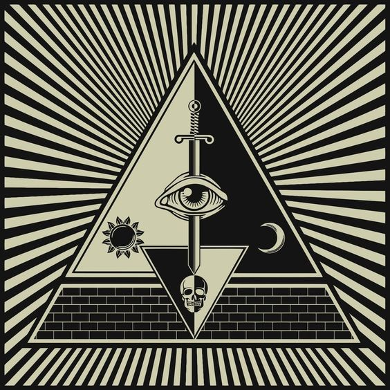

# Kernel

Kernel \( Keruneru ~ ケルネル \) is the most important character in the series, yet the one that will seem to have the less appeareances in everything.

Kernel is the Creator of the Multiverse and the one that is making sure that everything is processed properly. While Kernel doesn't have a physical form nor its biological, many cultures interpret him as an All-Mighty-Omniscient-Omnivision Triangle.

As the creator, Kernel is basically invencible and invulnerable to anything. However there is a catch in all of this. Kernel won't interfere in anything as he is too busy processing, interpreting, compiling and making sure that everything is being executed properly in the Divine Code. This is why he is also called _The Sleeping One._ It is believed that Kernel is in a deep-sleep state, processing the whole Reality.

## Trivia

* Kernel can be considered as the "_One True God_". No other entity in the Multiverse possess this same power. Nothing is above him. He is the beggining in all things.
* However, Cosmos and Chaos, while also considered Gods, they would be no match for Kernel if he decided to have a duel with them. And we also know how powerful Cosmos and Chaos are. Kernel is, then, a God amongst Gods.
* 
